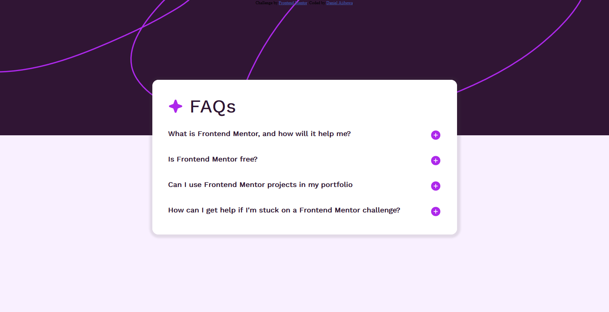
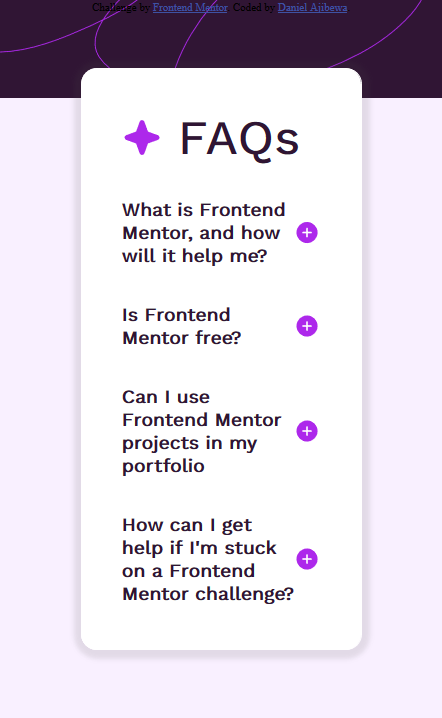

# Frontend Mentor - FAQ accordion solution

This is a solution to the [FAQ accordion challenge on Frontend Mentor](https://www.frontendmentor.io/challenges/faq-accordion-wyfFdeBwBz). Frontend Mentor challenges help you improve your coding skills by building realistic projects. 

## Table of contents

- [Overview](#overview)
  - [The challenge](#the-challenge)
  - [Screenshot](#screenshot)
  - [Links](#links)
- [My process](#my-process)
  - [Built with](#built-with)
  - [What I learned](#what-i-learned)
  - [Continued development](#continued-development)
  - [Useful resources](#useful-resources)
- [Author](#author)
- [Acknowledgments](#acknowledgments)

**Note: Delete this note and update the table of contents based on what sections you keep.**

## Overview

### The challenge

Users should be able to:

- Hide/Show the answer to a question when the question is clicked
- Navigate the questions and hide/show answers using keyboard navigation alone
- View the optimal layout for the interface depending on their device's screen size
- See hover and focus states for all interactive elements on the page

### Screenshot





### Links

- Solution URL: [GitHub Repo](https://github.com/stateman24/faq_accordion.git)
- Live Site URL: [Live Site](https://stateman24.github.io/faq_accordion/)

## My process

### Built with

- Semantic HTML5 markup
- CSS custom properties
- Flexbox
- CSS Grid
- Mobile-first workflow


### What I learned
- I learned how to add an event listener to the DOM that listens for keydown events
```js
document.addEventListener("keydown", function (event){
  let image = faq[currentIndex].querySelector('.question-box-box img')
  switch (event.key){
    case 'ArrowDown':
      currentIndex =(currentIndex + 1)% faq.length;
      break;
    case 'ArrowUp':
      currentIndex = (currentIndex - 1)% faq.length;
      if(currentIndex < 0){
        currentIndex = 0;
      }
      break;
    case 'ArrowLeft':
      faq[currentIndex].classList.toggle('active');
      if(image.src.includes("assets/images/icon-plus.svg")) {
        image.src = "assets/images/icon-minus.svg";
      }
      else{
        image.src = "assets/images/icon-plus.svg";
      }
      break;
    case 'ArrowRight':
      faq[currentIndex].classList.toggle('active');
      if(image.src.includes("assets/images/icon-plus.svg")) {
        image.src = "assets/images/icon-minus.svg";
      }
      else{
        image.src = "assets/images/icon-plus.svg";
      }
      break;
}
```
- I was able to hide contents using css using the `overflow` declaration and `height`
```css
.question-answer{
 height: 0;
overflow: hidden;
}
```

## Author

- Frontend Mentor - [@stateman24](https://www.frontendmentor.io/profile/stateman24)
- Twitter - [@ajibewa_daniel](https://www.twitter.com/ajibewa_daniel)

